# 🟦 Technical Specification Document (TSD)

## Automated Backup System – BackupBot

**Version:** 3.0
**Date:** 2025-12-01
**Status:** Production-Ready Specification
**License:** MIT / Apache 2.0 (pending)

---

# 1. Executive Summary

### 1.1 Objective

BackupBot is an automated backup and revision archival system built in **Go**, designed to continuously snapshot filesystem changes using a **containerized Jujutsu (jj) VCS runtime**. The system:

* Watches directories using **Jujutsu’s native file watcher**.
* Commits changes into a **shadow Jujutsu repository** isolated from the user's normal Git workflow.
* Pushes sync operations to remote Git/JJ endpoints via Jujutsu’s Git-compat layer.
* Maintains full state, crash recovery, and deduplicated revision history.
* Provides restore operations, monitoring, encryption, and multi-remote support.

### 1.2 Scope

**In Scope**

* Jujutsu-based file monitoring and revisioning
* Containerized shadow environment
* Multi-remote sync (Git/JJ/Gitea/Codeberg)
* Restore operations
* Observability & health
* Optional encryption layer

**Out of Scope**

* Real-time block-level replication
* Windows support (initial release Linux/macOS only)
* Native Git manipulation (only via Jujutsu Git interop)

---

# 2. Technology Stack & Dependencies

## 2.1 Core Dependencies

| Component             | Technology              | Governance    | Notes                            |
| --------------------- | ----------------------- | ------------- | -------------------------------- |
| **Language**          | Go 1.23+                | Open Source   | Static binary, high resilience   |
| **VCS Engine**        | Jujutsu (jj)            | EU/Global     | Immutable DAG, Git interop       |
| **Watcher**           | Jujutsu builtin fswatch | EU            | No external watchers required    |
| **Container Runtime** | Podman / Docker         | Open Source   | Rootless recommended             |
| **State Storage**     | SQLite (Go bindings)    | Public Domain | For checkpoints, queue, metadata |
| **Encryption**        | age or GPG              | Open Source   | Optional                         |
| **Config**            | YAML via go-yaml        | Open Source   |                                  |

**Changes from previous design:**

* Removed Python, watchdog, Git LFS dependency.
* Storage of large files now handled by **jj’s native tree/object model**, or optional integration with `jj git-lfs` if required.

## 2.2 Remote Storage Options

Same table as before but change “Git Repository” to “JJ/Git Repository”.

**Recommended Sovereign Remotes:**

1. Self-hosted Gitea (Git remote, jj interoperable)
2. Codeberg
3. GitLab (self-managed)

---

# 3. System Architecture

## 3.1 High-Level Component Overview

BackupBot now has **two containers**:

### A. **backup-bot (Go binary)**

* Config Parser (YAML)
* State Database (SQLite)
* Queue Manager (ops waiting to be materialized)
* Sync Manager (jj: add → commit → push)
* Encryption layer
* Metrics & Health
* Restore Manager

### B. **jj-sidecar container**

A fully isolated Jujutsu environment containing:

* Shadow workspace
* Operation log
* Clean DAG independent from local Git
* Filesystem watcher (jj native)
* Temp workspace for staging before sync
* Git interoperability: pushes through `jj git push`

This ensures:

* No interference with user’s normal Git workflows
* No risk of local Git hooks, credentials, ignored files, etc
* A clean 1:1 correspondence of “backup snapshots” → revisions

## 3.2 Execution Flow

### Flow Summary

1. `jj-sidecar` watches the host-mounted directories.
2. When detecting change, jj updates its workspace "dirty" state and emits an event through its built-in watcher.
3. `backup-bot` receives change events, debounces them, then:

   * Stages changes into the jj workspace
   * Creates a jj operation (immutable op log)
   * Creates a new revision (commit)
   * Pushes revision to remote (Git or JJ)
4. State stored in SQLite for crash recovery.

---

# 4. Functional Requirements (Revised for Jujutsu)

## 4.1 File Monitoring

* Use **Jujutsu built-in file watcher** (no Python/inotify needed).
* Detects creation, modification, rename, and deletion.
* Debounce window (default 10s).
* Respect jj ignore patterns (compatible with .gitignore).
* Follow symlinks only if configured.
* Optimized for high-churn directories.

## 4.2 Jujutsu Operations (Replacing Git ops)

BackupBot will use jj primitives:

* `jj track` automatically tracks files not ignored.
* `jj new` creates new commits referencing parent revisions.
* `jj describe` applies metadata.
* Commits always linear in backup branch (no merges).
* Each snapshot is a new revision in a monotonic DAG, under branch:

  ```
  backup/<HOST>/<DIR_NAME>
  ```
* Push operations use:

  ```
  jj git push <remote> --branch backup/<...>
  ```

## 4.3 Optional Git LFS equivalent

* If repo requires Git LFS and remote is Git, use:

  * `jj git-lfs import` on commit
  * `jj git-lfs push`
* Otherwise rely solely on jj native object store.

## 4.4 Restore Operations

* List jj revisions.
* Checkout revision into temporary workspace.
* Restore individual files or entire tree.
* Verify against jj’s object hash.

---

# 5. Non-Functional Requirements (Revised)

## 5.1 Performance (Go + jj)

* File detection latency: <250ms (jj-native)
* Commit creation: <5s for 1000 files
* Push performance: dependent on Git remote
* Memory: <120 MB baseline
* Queue throughput: >1000 events/sec

## 5.2 Reliability

* jj operation log stored in shadow container, crash resilient
* SQLite checkpointing
* Restart-safe file monitoring

## 5.3 Security

* Full isolation by containerizing jj
* No secret storage in logs
* Optional age-encryption of workspace or remote

## 5.4 Scalability

* Up to 20 watched directories per jj-sidecar instance
* Up to 500k files per workspace
* Horizontal scaling via multiple shadow containers

---

# 6. Monitoring & Observability

Minor text changes: Git → JJ.

---

# 7. Deployment Specifications

## 7.1 Two-container deployment

```
backup-bot             # Go binary
jj-sidecar             # Jujutsu runtime
```

* Both run rootless.
* Connect via localhost gRPC or Unix socket.
* Shared host mount for watched data.
* Separate persistent volumes:

  * `/state/backup.db`
  * `/jj-data/oplog`
  * `/jj-data/store`

## 7.2 Scaling

* Multiple jj-sidecar instances for different directories.
* Sharded repositories by size.

---

# 8. Compliance & Data Sovereignty

No changes except terminology (Git → Git/JJ).

---

# 9. Updated Architecture Diagram (Jujutsu Edition)

```mermaid
graph TB

subgraph Host
F1["/data/folder1 (watched)"]
F2["/data/folder2 (watched)"]
State["/persistent/backup.db"]
end

subgraph JJ-Sidecar["jj-sidecar (Shadow Jujutsu Env)"]
JJWatcher["JJ Watcher (native)"]
JJWC["JJ Workspace\nShadow Working Copy"]
JJOps["Jujutsu Operation Log"]
end

subgraph BackupBot["backup-bot (Go)"]
Queue["Change Queue\n(SQLite)"]
Config["Config Parser\n(YAML)"]
JJCommit["JJ Commit Manager\nnew → describe → push"]
Encrypt["Optional Encryption Layer"]
Health["Health & Metrics"]
Restore["Restore Manager"]
end

subgraph Remote
Repo["Git/JJ Remote Repository"]
end

F1 --> JJWatcher
F2 --> JJWatcher
JJWatcher --> Queue
Queue --> JJCommit
JJCommit --> Repo
JJCommit -.-> Restore
Restore -.-> F1
JJOps -.-> JJCommit
```



---

# ✔ Ready for next phase

If you'd like, I can:

✅ Generate a **container-compose.yml** for backup-bot + jj-sidecar
✅ Generate a **Go folder layout + main.go skeleton**
✅ Generate a **jj configuration preset**
✅ Write the **ADR for switching from Git to Jujutsu**

Just tell me.
