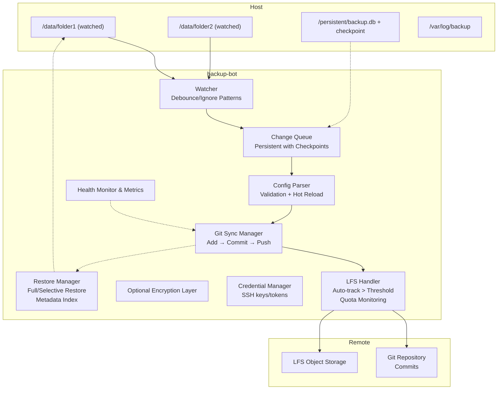

# Technical Specification Document (TSD)

## Automated Backup System – BackupBot

**Version:** 2.1
**Date:** 2025-11-30
**Status:** Production-Ready Specification
**License:** MIT / Apache 2.0 (to be decided)

---

### 1. Executive Summary

This section provides a high-level overview of the BackupBot project, including its primary objectives, scope, and core principles. It is intended to give readers a quick understanding of the project's purpose and goals.

#### 1.1 Objective

BackupBot is a production-grade automated backup system that continuously monitors local directories, commits changes to Git repositories with LFS support, and pushes updates to remote storage. The system emphasizes:
- **Data Sovereignty:** Transparent dependency origins and self-hosted options.
- **Operational Resilience:** State persistence, crash recovery, and queue checkpoints.
- **Security:** Non-root execution, credential isolation, and optional encryption.
- **Extensibility:** A modular architecture enabling multi-remote and flexible restore operations.

#### 1.2 Scope

- **In scope:** File monitoring, Git operations, LFS handling, containerized deployment, restore functionality, monitoring, and alerting.
- **Out of scope:** Real-time replication, blockchain-based storage, and Windows filesystem monitoring (v1.0 only supports Linux/macOS).

---

### 2. Technology Stack & Dependency Analysis

This section details the technologies, libraries, and external services that BackupBot will rely on. It includes an analysis of each dependency's origin, governance, and potential risks, as well as a list of recommended remote storage and monitoring solutions.

#### 2.1 Core Dependencies

| Component         | Technology    | Origin      | Governance   | US Dependency | Risk   | Alternatives         |
|-------------------|---------------|-------------|--------------|---------------|--------|----------------------|
| Container Runtime | Docker Engine | US          | Open Source  | High          | High   | Podman, containerd   |
| Base Image        | Alpine Linux  | Switzerland | Community    | Low           | Low    | Debian, Ubuntu       |
| Version Control   | Git           | US          | Open Source  | Medium        | Medium | Fossil, Pijul        |
| LFS Extension     | Git LFS       | US          | Open Source  | High          | High   | git-annex, DVC       |
| Language          | Python 3.11+  | US          | Open Source  | Medium        | Medium | Go, Rust             |
| File Monitoring   | watchdog      | Global      | Open Source  | Low           | Low    | inotify-tools, entr  |
| Config Parser     | PyYAML        | Global      | Open Source  | Low           | Low    | TOML, JSON           |
| State Storage     | SQLite        | US          | Public Domain| Low           | Low    | PostgreSQL, LMDB     |
| Encryption        | git-crypt     | US          | Open Source  | Medium        | Medium | gpg, age             |

#### 2.2 Remote Storage Options

| Provider              | Jurisdiction | Data Centers | Open Source | Self-Hostable | Notes                                   |
|-----------------------|--------------|--------------|-------------|---------------|-----------------------------------------|
| Gitea                 | N/A          | Self-hosted  | Yes (MIT)   | Yes           | Full sovereignty, requires maintenance  |
| Codeberg              | Germany      | Germany      | Yes (MIT)   | Community     | EU-compliant, no LFS bandwidth charges  |
| GitLab (self-managed) | US/EU        | Configurable | Yes (MIT)   | Yes           | Flexible hosting, any cloud             |
| GitLab.com            | US/EU        | GCP/AWS      | Partial     | No            | Partial US oversight                    |
| GitHub                | US           | Azure        | Partial     | No            | Proprietary, dominant platform          |

**Recommendation Hierarchy (by sovereignty):**
1. Self-hosted Gitea
2. Codeberg
3. GitLab self-managed
4. GitLab.com EU region
5. GitHub

#### 2.3 Monitoring & Observability

| Tool             | Origin        | License   | US Dependency | Purpose                                  |
|------------------|---------------|-----------|---------------|------------------------------------------|
| VictoriaMetrics  | Estonia       | Apache 2.0| Low           | Metrics collection alternative to Prometheus |
| Netdata          | Greece/Global | GPLv3+    | Low           | Real-time monitoring and visualization   |
| Prometheus       | US            | Apache 2.0| Medium        | Metrics collection                       |
| Grafana          | US            | AGPLv3    | Medium        | Visualization dashboard                  |
| Loki             | US            | AGPLv3    | Medium        | Log aggregation                          |

---

### 3. System Architecture

This section describes the overall architecture of BackupBot, including its main components, how they interact, and the flow of data through the system. It also covers how the system maintains state and recovers from interruptions.

#### 3.1 Component Overview

- **Host Machine:** Contains the monitored directories, persistent state database, and log storage.
- **Container (backup-bot):**
  - **Watcher:** Monitors directories with debounce and ignore patterns.
  - **Change Queue:** A persistent, transactional storage of detected file events.
  - **Config Parser:** Validates and loads the YAML configuration.
  - **Git Sync Manager:** Adds, commits, branches, and pushes changes.
  - **LFS Handler:** Auto-tracks large files, monitors quotas, and triggers alerts.
  - **Encryption Layer:** Optional git-crypt or GPG encryption.
  - **Credential Manager:** Manages SSH keys/tokens securely with read-only mounts.
  - **Health Monitor:** Exposes metrics and checks for remote connectivity, disk space, and push health.
  - **Restore Manager:** Supports full or selective restores and uses a metadata index for verification.
- **Remote:** The Git repository and LFS object storage.

#### 3.2 Data Flow States

| State          | Description                    | Trigger               | Rollback                |
|----------------|--------------------------------|-----------------------|-------------------------|
| **Watched**    | File in monitored directory    | Initial configuration | N/A                     |
| **Detected**   | Change event captured          | File system watcher   | N/A                     |
| **Queued**     | Event stored in buffer         | Debounce expiry       | Clear queue entry       |
| **Staged**     | Files prepared for commit      | Queue processing      | Rollback staging        |
| **Committed**  | Local Git commit created       | Staging success       | Undo soft commit        |
| **LFS-Processed**| Large files processed          | Size detection        | Untrack LFS files       |
| **Pushed**     | Remote repository updated      | Network success       | Retry queued commits    |
| **Failed**     | Push/commit error              | Network/auth failure  | Retry logic             |

#### 3.3 State Persistence

- A persistent SQLite database stores the change queue, push history, LFS usage, config checksum, and a checkpoint for crash recovery.
- Checkpoints enable the system to resume interrupted operations and prevent duplicate commits.

---

### 4. Functional Requirements

This section defines the specific functions and capabilities of BackupBot, detailing what the system must be able to do from a user's perspective.

#### 4.1 File Monitoring
- Recursively monitor multiple directories.
- Detect file creation, modification, and deletion.
- Apply ignore patterns (glob or .gitignore style).
- Debounce rapid changes (configurable, default 10s).
- Handle symlinks safely.
- Exclude system files automatically.
- Manage large directories and high file churn.

#### 4.2 Git Operations
- Initialize repositories and configure bot identity.
- Create timestamped commits with a configurable branch/tag strategy.
- Retry failed pushes with exponential backoff.
- Reject non-fast-forward merges and alert the operator.
- Support shallow clones for restores.
- Batch commits, triggered by a file threshold or elapsed time.
- Ensure idempotent operations by checking for pending changes before committing.

#### 4.3 Git LFS Integration
- Automatically track files above a configurable size threshold.
- Track files by extension patterns.
- Monitor LFS quota usage and send alerts at configurable thresholds.
- Prune old LFS objects according to a retention policy.
- Verify that LFS uploads match local objects.
- Handle quota and authentication failures gracefully.

#### 4.4 Configuration Management
- Use a YAML-based configuration schema with validation.
- Support schema versioning and hot-reloading of the configuration.
- Validate directories, debounce settings, LFS thresholds, and retry backoff settings.
- Include optional encryption settings for git-crypt or GPG.

#### 4.5 Restore Operations
- List available backups (by tags or a metadata index).
- Restore an entire backup or individual files.
- Restore to custom paths.
- Verify the integrity of restores via metadata checksums.
- Support both manual and automated workflows.

---

### 5. Non-Functional Requirements

This section outlines the quality attributes of the system, such as performance, reliability, security, and scalability. These requirements define *how well* the system should perform its functions.

#### 5.1 Performance
- **File detection latency:** <1s
- **Commit creation time:** <10s for 1000 files
- **Push duration:** <60s per 1GB (LFS dependent)
- **Container memory usage:** <256 MB baseline
- **Idle CPU usage:** <5%
- **Queue processing:** >500 files/sec

**Optimization:** Batch Git adds, batch LFS uploads, and use connection pooling for remotes.

#### 5.2 Reliability
- A graceful shutdown ensures the queue is flushed to disk.
- Crash recovery resumes from the last checkpoint.
- Retry logic ensures network resilience.
- Disk space monitoring prevents data loss.
- LFS upload verification guarantees object consistency.

#### 5.3 Security
- Run with non-root execution (UID/GID configurable).
- Use read-only mounts for credentials.
- Do not store secrets in images or logs.
- Provide an optional encryption layer (git-crypt/GPG).
- Include audit logging of Git operations.
- Support key rotation and ephemeral credential handling.

**Threat Mitigation:** Host compromise, key theft, network interception, and unauthorized remote access.

#### 5.4 Scalability
- **Max directories per container:** 10 (inotify limit)
- **Support for large directories:** 100k files
- **Repository size limit:** 50 GB (without LFS)
- **Single LFS object size limit:** 5 GB
- **Horizontal scaling:** Supported via multiple containers or repository sharding.

---

### 6. Monitoring & Observability

This section describes how BackupBot's health and performance will be monitored. It specifies the key metrics to be collected, the health checks to be performed, and the conditions that should trigger alerts.

#### 6.1 Metrics
- Total files committed
- Push duration histograms
- LFS usage metrics
- Push failures and retry counts
- Queue size and pending events

#### 6.2 Health Monitoring
- Remote repository connectivity
- Disk space thresholds
- A check for the most recent successful push
- Alerts triggered if any check fails

#### 6.3 Alerting Rules
- **Critical:** Backup push is stale (>6h)
- **Warning:** LFS quota is >80%
- **Warning:** Push failure rate is high
- **Warning:** Backup queue has a large backlog

---

### 7. Deployment Specifications

This section provides details on how to deploy and scale the BackupBot application, with a focus on containerization and best practices for production environments.

#### 7.1 Container Deployment
- Use a multi-stage image for minimal runtime dependencies.
- Run as a non-root user with UID/GID configuration.
- Use persistent mounts for data, state, and logs.
- Provide an optional read-only root filesystem.
- Validate environment variables at container start.
- Handle signals for graceful shutdown and queue flushing.

#### 7.2 Scaling Strategy
- Increase inotify watches for large directories.
- Deploy multiple containers for horizontal scaling.
- Shard repositories for very large datasets.

---

### 8. Compliance & Data Sovereignty

This section addresses compliance and data sovereignty concerns, providing guidance on how to configure and deploy BackupBot in a way that aligns with regulatory requirements and data privacy goals.

- Prefer self-hosted or EU-based providers for sovereignty.
- Use optional client-side encryption for sensitive data.
- Monitor remote provider policies for GDPR, ITAR/EAR compliance.
- Document region and provider choices for audits.

---

### 9. Architecture Diagram

This diagram visualizes the system's architecture, showing the relationships between the host machine, the BackupBot container, and the remote storage.

---

This version is ready for human review and development planning, fully cleaned of code, focused on processes, architecture, requirements, and operational guidance, and includes all enhancements from state persistence, LFS monitoring, security, restore operations, and observability.
